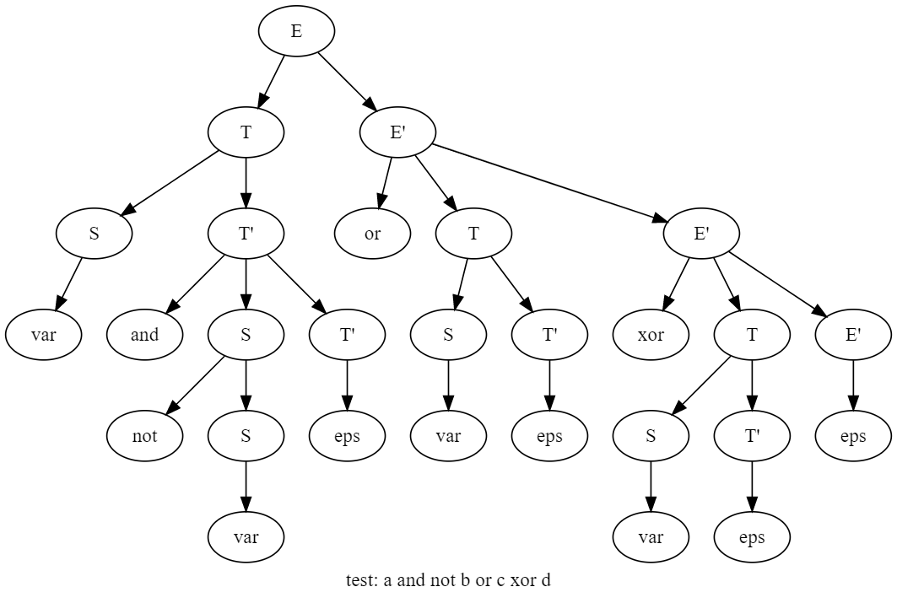
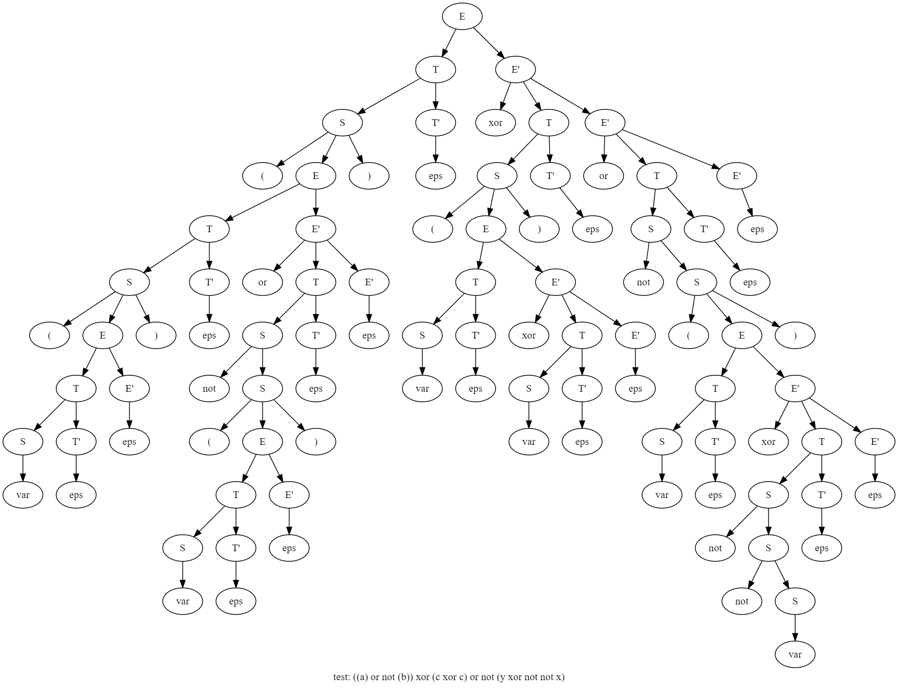

# Лабораторная работа №2. 
#### Ручное построение нисходящих синтаксических анализаторов 
Выполнила Карасева Екатерина M33351

#### Вариант 3. Логические формулы в стиле Python 
Логические формулы. Используются операции and, or, xor, not. Приоритет операций стандартный. Скобки могут использоваться для изменения приоритета. В качестве операндов выступают переменные с именем из одной буквы. Используйте один терминал для всех переменных. Для каждой логической операции должен быть заведен один терминал (не три ‘a’, ‘n’, ‘d’ для and). 
Пример: (a and b) or not (c xor (a or not b))

1. Разработка грамматики 
    <ul>
        <li> Грамматика, учитывающая левоассоциативность и приоритеты операций:
            
 E -> E or T 

            
 E -> T 

            
 T -> T and F 

            
 T -> F 

            
 F -> F xor S 

            
 F -> S 

            
 S -> (E) 

            
 S -> [a-z] 

            
 S -> not S 

            
 (заметно, что есть левая рекурсия) 

            <table>
                <tr>
                    <td> Нетерминал </td>
                    <td> Описание </td>
                </tr>
                <tr>
                    <td> E </td>
                    <td> Дизъюнкция или T </td>
                </tr>
                <tr>
                    <td> T </td>
                    <td> Конъюнкция или F </td>
                </tr>
                <tr>
                    <td> F </td>
                    <td> Строгая дизъюнкция или S </td>
                </tr>
                <tr>
                    <td> S </td>
                    <td> Переменная или приоритетное выражение или отрицание S </td>
                </tr> 
            </table>
        </li>
        <li> Грамматика без левой рекурсии:
            
 E -> TE’ 

            
 E’ -> or TE’ 

            
 E’ -> xor TE’ 

            
 E’ -> eps 

            
 T -> ST’ 

            
 T’ -> and ST’ 

            
 T’ -> eps 

            
 S -> (E) 

            
 S -> VAR 

            
 S -> not S 

            
 (избавились от левой рекурсии, правого ветвления нет) 

            <table>
                <tr>
                    <td> Нетерминал </td>
                    <td> Описание </td>
                </tr>
                <tr>
                    <td> E </td>
                    <td> T или дизъюнкция </td>
                </tr>
                <tr>
                    <td> E' </td>
                    <td> eps или второй аргумент дизъюнкции </td>
                </tr>
                <tr>
                    <td> T </td>
                    <td> F или конъюнкция </td>
                </tr>
                <tr>
                    <td> T' </td>
                    <td> eps или второй аргумент конъюнкции </td>
                </tr>
                <tr>
                    <td> F </td>
                    <td> S или строгая дизъюнкция </td>
                </tr>
                <tr>
                    <td> F' </td>
                    <td> eps или второй аргумент строгой дизъюнкции </td>
                </tr>
                <tr>
                    <td> S </td>
                    <td> Переменная или приоритетное выражение или отрицание S </td>
                </tr> 
            </table>
        </li>
    </ul>
1. Построение лексического анализатора
    * [Token](src/Token.java)
    * [LexicalAnalyzer](src/LexicalAnalyzer.java)
1. Построение синтаксического анализатора
    * [Tree](src/Tree.java)
    * [Parser](src/Parser.java)
    <table>
        <tr>
            <td> Нетерминал </td>
            <td> FIRST </td>
            <td> FOLLOW </td>
        </tr>
        <tr>
            <td> E </td>
            <td> ( VAR not </td>
            <td> ) </td>
        </tr>
        <tr>
            <td> E' </td>
            <td> or EPS </td>
            <td> ) </td>
        </tr>
        <tr>
            <td> T </td>
            <td> ( VAR not </td>
            <td> or EPS </td>
        </tr>
        <tr>
            <td> T' </td>
            <td> EPS and </td>
            <td> or EPS </td>
        </tr>
        <tr>
            <td> F </td>
            <td> ( VAR not </td>
            <td> EPS and </td>
        </tr>
        <tr>
            <td> F' </td>
            <td> EPS xor </td>
            <td> EPS and </td>
        </tr>
        <tr>
            <td> S </td>
            <td> ( VAR not </td>
            <td> EPS xor </td>
        </tr>
    </table>
1. Визуализация дерева разбора

1. Подготовка набора тестов
    <table>
    	<tr>
    		<td> Тест </td>
    		<td> Описание </td>
    		<td> Результат </td>
    	</tr>
    	<tr>
    		<td> a and b </td>
    		<td> Тест на and </td>
    		<td> test passed </td>
    	</tr>
    	<tr>
    		<td> a or b </td>
    		<td> Тест на or </td>
    		<td> test passed </td>
    	</tr>
    	<tr>
    		<td> a xor b </td>
    		<td> Тест на xor </td>
    		<td> test passed </td>
    	</tr>
    	<tr>
    		<td> not a </td>
    		<td> Тест на not </td>
    		<td> test passed </td>
    	</tr>
    	<tr>
    		<td> a </td>
    		<td> Тест на var </td>
    		<td> test passed </td>
    	</tr>
    	<tr>
    		<td>     not    a    or   (  b )      </td>
    		<td> Тест на пробелы </td>
    		<td> test passed </td>
    	</tr>
    	<tr>
    		<td> a and not b or c xor d </td>
    		<td> Тест на разбор всех операций и их корректный приоритет </td>
    		<td> test passed </td>
    	</tr>
    	<tr>
    		<td> (not a and (b or c)) xor d </td>
    		<td> Тест на корректный приоритет выражения в скобках </td>
    		<td> test passed </td>
    	</tr>
    	<tr>
    		<td> not not a or not b and not not not c </td>
    		<td> Тест на множественное отрицание переменных </td>
    		<td> test passed </td>
    	</tr>
    	<tr>
    		<td> not (a or b) xor a </td>
    		<td> Тест на отрицание выражения </td>
    		<td> test passed </td>
    	</tr>
    	<tr>
    		<td> ((a) or not (b)) xor (c xor c) or not (y xor not not x) </td>
    		<td> Комбинированный тест </td>
    		<td> test passed </td>
    	</tr>
    	<tr>
    		<td> "" </td>
    		<td> Пустая строка </td>
    		<td> test failed: null </td>
    	</tr>
    	<tr>
    		<td> a and </td>
    		<td> Отсутствует второй аргумент and </td>
    		<td> test failed: null </td>
    	</tr>
    	<tr>
    		<td> a or </td>
    		<td> Отсутствует второй аргумент or </td>
    		<td> test failed: null </td>
    	</tr>
    	<tr>
    		<td> a xor </td>
    		<td> Отсутствует второй аргумент xor </td>
    		<td> test failed: null </td>
    	</tr>
    	<tr>
    		<td> a or not </td>
    		<td> Отсутствует аргумент not </td>
    		<td> test failed: null </td>
    	</tr>
    	<tr>
    		<td> xor </td>
    		<td> Отсутствуют 2 аргумента </td>
    		<td> test failed: null </td>
    	</tr>
    	<tr>
    		<td> (a and not b </td>
    		<td> Не хватает закрывающей скобки </td>
    		<td> parse error: ) expected at position  </td>
    	</tr>
    	<tr>
    		<td> not b) </td>
    		<td> Не хватает открывающей скобки </td>
    		<td> test failed: null </td>
    	</tr>
    	<tr>
    		<td> a b </td>
    		<td> Отсутствует операция между переменными </td>
    		<td> test failed: null </td>
    	</tr>
    	<tr>
    		<td> a or not() </td>
    		<td> Пустые скобки </td>
    		<td> test failed: null </td>
    	</tr>
    	<tr>
    		<td> a andnot b </td>
    		<td> Отсутствие пробела между токенами </td>
    		<td> parse error: Illegal character n </td>
    	</tr>
    	<tr>
    		<td> a or not(or) </td>
    		<td> Некорректное выражение внутри not </td>
    		<td> test failed: null </td>
    	</tr>
    	<tr>
    		<td> () or b </td>
    		<td> Некорректный первый аргумент </td>
    		<td> test failed: null </td>
    	</tr>
    	<tr>
    		<td> a or () </td>
    		<td> Некорректный второй аргумент </td>
    		<td> test failed: null </td>
    	</tr>
    	<tr>
    		<td> a ant b </td>
    		<td> Неверный токен </td>
    		<td> parse error: Illegal character t </td>
    	</tr>
    	<tr>
    		<td> (a and b) + sth </td>
    		<td> Отсутствует токен END после корректного выражения </td>
    		<td> parse error: Illegal character + </td>
    	</tr>
    </table>

